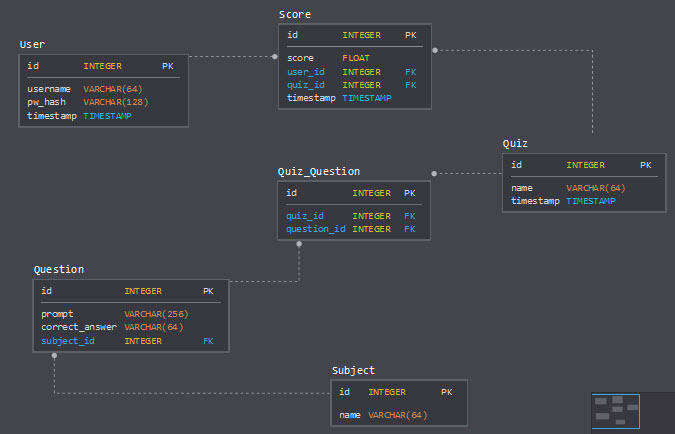

# flask-quiz

A quiz generator and runner. Upload metrics from Excel to dynamically generate questions and answers. Data from each sheet is combined to build a question bank per Excel file.

Example Excel sheet:

| State	| 2018 Population	| Rank
| --- | :---: | ---:
| California | 39776830 | 1
| Texas	| 28704330 | 2
| Florida	| 21312211 | 3

Example question bank:
1. Given the __State__ is __California__, what is the __2018 Population__?
1. Given the __State__ is __Texas__, what is the __2018 Population__?
1. Given the __State__ is __Florida__, what is the __2018 Population__?
1. Given the __2018 Population__ is __39776830__, what is the __State__?
1. Given the __2018 Population__ is __28704330__, what is the __State__?
1. Given the __2018 Population__ is __21312211__, what is the __State__?
1. Given the __State__ is __California__, what is the __Rank__?
1. Given the __State__ is __Texas__, what is the __Rank__?
1. Given the __State__ is __Florida__, what is the __Rank__?
1. Given the __Rank__ is __1__, what is the __State__?
1. Given the __Rank__ is __2__, what is the __State__?
1. Given the __Rank__ is __3__, what is the __State__?

**Note**: The application assumes that the first column contains the 'key' data point (e.g., *State*). Thus all questions include that data point in either the prompt or the answer.

Absent from the question bank are the following, as they do not include the 'key' data point, and can be more ambiguous:

1. Given the __2018 Population__ is __39776830__, what is the __Rank__?
1. Given the __2018 Population__ is __28704330__, what is the __Rank__?
1. Given the __2018 Population__ is __21312211__, what is the __Rank__?
1. Given the __Rank__ is __1__, what is the __2018 Population__?
1. Given the __Rank__ is __2__, what is the __2018 Population__?
1. Given the __Rank__ is __3__, what is the __2018 Population__?


## Install
```
pip install -r requirements.txt
npm init
npm --save-dev requests
```

## Run

### Production
```
flask run
```

### Development
```
export FLASK_ENV=development
flask run
```
or
```
flask run --reload --debugger
```

## Routes
```
# available
/                 # redirect to login
/index            # redirect to login
/auth/login       # login page
/auth/logout      # logout, redirect to login
/quiz             # quiz menu
/quiz/{quiz}/{#}  # quiz question #

# future release
/quiz/{quiz}      # instructions for {quiz}
/quiz/upload      # quiz upload form
/user             # user management
/user/{user}      # statistics for {user}
```

## Phases
Phase | Hours | Status
:--- | ---: | ---
Flask page with sample data & score tracking | 5 | :heavy_check_mark:
Simple Excel-driven quiz | <del>3</del> 2 | :heavy_check_mark:
Percentage points off | <del>3</del> 2 |
Directory-based Quiz selection | <del>2</del> 0 | :heavy_check_mark:
Database-driven quiz history | <del>4</del> <del>6</del> 7 | :heavy_check_mark:
GUI based on Bootstrap 4 and/or Material Design | 6 |
Public / Private Quizzes | 2 |
Quiz Modes<br>- Instant Feedback<br>- Test<br>- Retake Incorrect<br>- Flash Cards<br>- Multiple Choice | <br>0<br>1<br>1<br>2<br>3 | 
**Total** | **31**

### Flask page with sample data & score tracking
The website engine is driven by the Flask microframework. Hard-coded sample data will be converted to questions dynamically on page load, and sessions will be used to track answers and scores.

### Simple Excel-driven quiz
This phase adds the ability to upload Excel files as quiz data.

### Percentage points off
This phase adds the mathematical logic for determining the percentage off the guess was from the correct answer, and incorporating it into the score.

### Directory-based Quiz selection
A menu page will be added to select from a list of Excel files found in a specified folder. After database integration, this will be used for uploading Excel data as quizzes to be saved.

### Database-driven quiz history
Database functionality includes storing user info, including previous test scores, as well as saving uploaded quiz data.

### Material Design-based GUI
This phase will convert the text-based, simple web page to having dynamic elements, custom buttons, and a consistent style throughout all pages.

## Database Design

